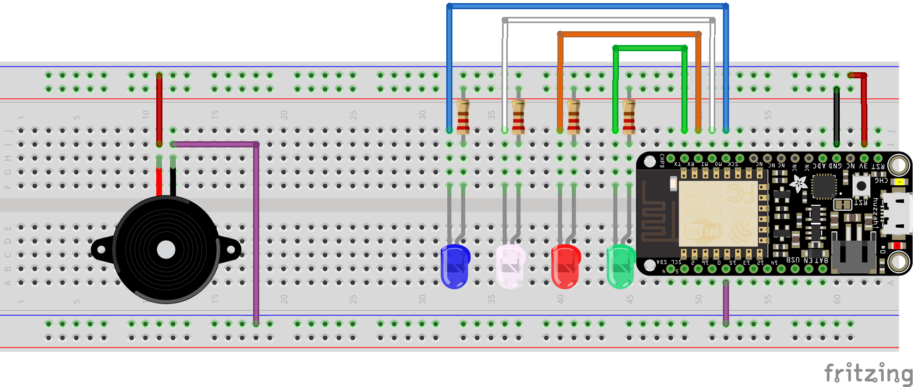
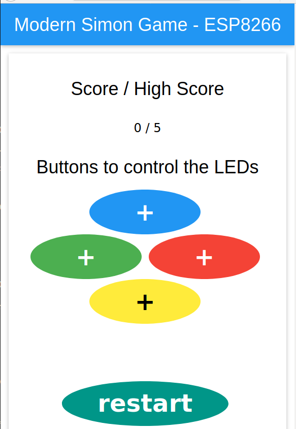

# Modern Simon Game

Simon is an electronic game of memory skills. The device creates a series of tones and lights and requires a user to repeat the sequence in a given time. This Simon game is a little bit different from the classic one: instead of having physical buttons you can push, you virtual buttons, *i.e.* you need to click, either with your computer or smartphone, on the web application's buttons.

## Installation

To install the game, you'll need:

* a ESP8266;
* an IDE (either Arduino IDE or VSCode's extension platformIO);
* 4 LEDs and 4 resistors;
* A piezo.

The electronic schema is quite simple since you don't need physical buttons:

You need to include these two libraries:

https://github.com/me-no-dev/ESPAsyncWebServer
https://github.com/me-no-dev/ESPAsyncTCP

To install the game, you just need to pull my repository, upload the file system (with the css, JS and HTML files) (platformio: 'upload file system image' for arduino IDE: please refer to https://randomnerdtutorials.com/esp32-web-server-spiffs-spi-flash-file-system/, 'Uploading Code and Files' section), change the two constants, ssid and password, to put yours, build main.cpp and upload the binary file.

## Interface

After uploading the code on your ESP8266, you'll need to reach the server. To do so, open the Serial Monitor to get the IP address of the card. You should see this interface after reaching the server:

You can use either your smartphone or computer even though the interface is more "nice-looking" on a smartphone.